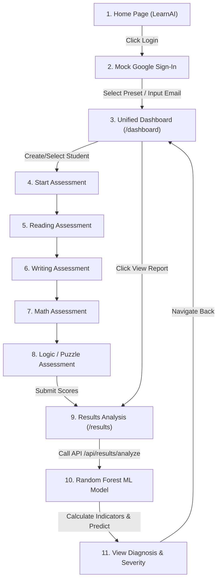

# 🧠 Project Status & Execution Flow Report

This document outlines the current state of the AI-Based Learning Disability Detection System, listing all functional features, their statuses, and the end-to-end execution flow of the application.

---

## 📊 Feature Status Matrix

| Module | Feature / Endpoint | Status | Description |
| :--- | :--- | :--- | :--- |
| **Auth** | Mock Google Sign-In | 🟢 Active | High-fidelity mock Google accounts list and custom entry. |
| **Auth** | Email Persistence | 🟢 Active | Auto-registers or restores user sessions matching by email. |
| **Dashboard** | Unified Dashboard | 🟢 Active | Dashboard listing all student records, history, and actions. |
| **Assessment** | Student Management | 🟢 Active | Add new students (name, age, grade) to the current user's profile. |
| **Assessment** | Reading Test | 🟢 Active | Paragraph reading speed, WPM calculation, delay %, and comprehension. |
| **Assessment** | Writing Test | 🟢 Active | Visual spelling error estimation, completeness, and clarity rating. |
| **Assessment** | Math Test | 🟢 Active | Custom questions matching student age; gives instant response validation. |
| **Assessment** | Puzzle & Logic Test | 🟢 Active | Logic patterns, sequence completions, and reasoning assessment. |
| **ML Engine** | RandomForest API | 🟢 Active | Runs a predictive Random Forest Classifier (99% test accuracy). |
| **ML Engine** | Disability Analyzer | 🟢 Active | Computes indicator scores (Dyslexia, Dysgraphia, Dyscalculia, ADHD). |
| **Reports** | Assessment Reports | 🟢 Active | Dynamic graphs, indicator levels, severity indexes, and diagnostics. |
| **History** | Persistent History Table | 🟢 Active | List of previous assessments and outcomes persistent by login email. |

---

## 🔄 Complete Execution Flow

### Flow Step-by-Step Breakdown:

1. **Onboarding & Authentication:**
   - The user visits the home page and clicks **Login / Get Started**.
   - They enter the **Mock Google Sign-In Sandbox**. They can select a preset tester (e.g. `jane.doe@gmail.com`) or input their own Google email/name.
   - The frontend calls `POST /api/auth/google-login`. If it's a new email, it registers a new account on-the-fly; otherwise, it logs into the existing record. The server returns a JWT token.
   - The user is redirected to the `/dashboard`.

2. **Dashboard & Student Selection:**
   - The user sees the unified **Student Assessment Dashboard**.
   - If they have students registered under their email, the list appears. They can select one.
   - If not, they click **+ Add New Student** (providing name, age, and grade).
   - Once a student is selected, they click **Start Assessment**.

3. **Assessment Walkthrough (4 Modules):**
   - **Reading Test (`/reading-test`):** The student reads a paragraph. Timer tracks duration to calculate Words Per Minute (WPM) and time delay. The student then answers 3 comprehension questions.
   - **Writing Test (`/writing-test`):** The student types a designated list of spelling words. Completeness and basic spelling error rates are processed.
   - **Math Test (`/math-test`):** The student is shown age-appropriate math questions with multiple choice selections and instant validation.
   - **Puzzle Test (`/puzzle-test`):** The student solves logic sequence and reasoning puzzles.

4. **ML Analysis & Diagnostics:**
   - When the final test completes, the frontend submits the assessment data.
   - The frontend routes the user to the `/results` page, which fetches details and calls the backend `/api/results/analyze` endpoint.
   - The backend runs the scores through the **Disability Analyzer** class. It calculates 4 indicator factors (reading, writing, math, logic) and references the trained RandomForest model (`model.pkl`).
   - The system yields a diagnosis (e.g. *Dyslexia*, *Dyscalculia*, *Dysgraphia*, *ADHD*, *Mild Reading Difficulty*, or *No Learning Disability Detected*), calculating severity percentages, confidence scores, and custom explanation notes.

5. **Tracking & Records Review:**
   - The assessment changes status to `completed` and is recorded in the assessment history table.
   - The user can review the dynamically drawn bar chart and indicators.
   - They can return to the dashboard, where the assessment history table lists the student's name, date, completion status, and diagnosis.
   - Clicking **View Report** on any past entry pulls the historical data and renders the report.

---

## 🛠️ Technology Stack & System Components

* **Frontend:** React 19, Vite 8, Framer Motion (Animations), Chart.js (Visualization), Tailwind CSS (Styling).
* **Backend:** Flask 3, Flask-SQLAlchemy (ORM), SQLite (Database, `instance/learning_disability.db`), PyJWT (Auth Tokens).
* **Machine Learning:** scikit-learn (RandomForestClassifier, `backend/models/model.pkl`), Pandas, NumPy.
* **Storage:** Student details, authentication hashes, assessments, and model output records are stored locally in the SQLite database file.
